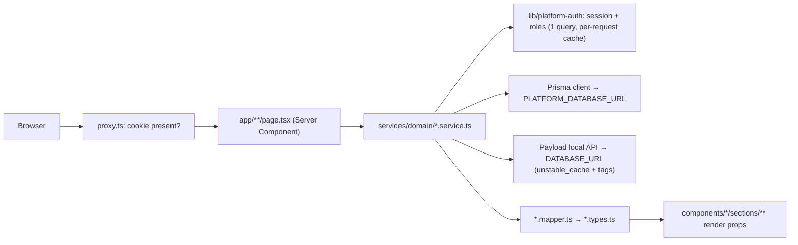

# Architecture overview

## One app, four route groups

`app/` holds four route groups, each with its **own root layout** (`<html>` and `<body>`), its own fonts and its own stylesheet. They share nothing visual; they only share the codebase.

| Group            | Root layout                                                                                                                          | Styles                              | Purpose                      |
| ---------------- | ------------------------------------------------------------------------------------------------------------------------------------ | ----------------------------------- | ---------------------------- |
| `app/(frontend)` | `(frontend)/layout.tsx` — `metadataBase`, Open Graph defaults, Google Analytics, Meta Pixel, Vercel Analytics (only when `VERCEL=1`) | `globals.css` + a CSS file per page | Public site                  |
| `app/(payload)`  | Payload's `RootLayout` from `@payloadcms/next/layouts`                                                                               | Payload's CSS + `custom.css`        | `/admin` and `/api/*`        |
| `app/(auth)`     | `(auth)/layout.tsx` — platform tokens, no shell                                                                                      | `globals.css` + `platform.css`      | `/iniciar-sesion`, `/entrar` |
| `app/(platform)` | `(platform)/layout.tsx` — `PlatformShell` (top bar, role menu, logout), `dynamic = "force-dynamic"`                                  | `globals.css` + `platform.css`      | Everything behind login      |

Because there are several root layouts, a URL that matches none of them cannot fall back to a group's `not-found.tsx`; `next.config.ts` enables `experimental.globalNotFound` and `app/global-not-found.tsx` renders the Spanish 404 with its own `<html>`. `app/global-error.tsx` does the same for errors thrown by a root layout.

## Request flow



1. **`proxy.ts`** (Next 16's middleware) runs on a literal matcher. It only checks whether the session cookie _exists_: private prefixes without a cookie are redirected to `/iniciar-sesion?next=…`; a visit to `/` with a cookie is redirected to `/entrar`, which reads the real session and sends the user to the home of their highest role (or deletes a stale cookie and returns to `/`). The proxy never touches a database.
2. **Pages** are Server Components. They `await params`, call one service per section, and render.
3. **Services** resolve identity through the DAL, query Prisma or Payload with the authorisation inside the `where`, and hand rows to the mapper.
4. **Mappers** produce the view types: Spanish labels, formatted dates, computed percentages and ready-made hrefs from `lib/platform-routes.ts`.
5. **Sections** receive props and render. Client Components appear only at the leaves that need state (viewer, board, forms with `useActionState`, upload widget).

Writes go through **server actions** (`services/<domain>/<domain>.actions.ts`) that repeat the same discipline: identity from the DAL, rate limit, bounded inputs, ownership checks, then `revalidatePath`.

## Directory map

```text
app/
  (frontend)/         page.tsx (static home, revalidate 3600), landing-page.tsx, blog/, nosotros/, mentor/[slug]/,
                      reloj-de-ajedrez/, error.tsx, not-found.tsx, opengraph-image.tsx, fonts.ts, globals.css
  (payload)/          admin/[[...segments]]/, api/[...slug]/route.ts (generated by Payload), layout.tsx, custom.css
  (auth)/             iniciar-sesion/page.tsx, entrar/route.ts, layout.tsx
  (platform)/         inicio/, clases/, estudios/, cursos/, lecciones/, entrenador/, explorador/, profesor/,
                      administracion/, layout.tsx, loading.tsx, error.tsx, not-found.tsx, platform.css, fonts.ts
  global-error.tsx  global-not-found.tsx  robots.ts  sitemap.ts
  favicon.ico  icon.svg  apple-icon.png   (the 2x2 board: icon.svg is the source, the other two are rendered from it)
components/
  chess/              chess-board, chess-board-lazy, static-diagram, elo-table, analysis-board/, game-viewer/
                      (shared by the public site and the platform; the React side of lib/chess)
  icons/              one file per SVG icon component
  site/               = app/(frontend): sections/ (shell, home, nosotros, blog, chess-clock)
                      and shared/ (logo, google-analytics, meta-pixel)
  platform/           = app/(platform): sections/ (shell, dashboard, courses, studies, classes,
                      explorer, trainer, teacher, staff) and shared/ (form-field, platform-table,
                      platform-notice, empty-state, loading-panel, local-datetime, image-upload…)
  auth/               = app/(auth): sections/login
services/             articles, auth, classes, courses, dashboard, game-explorer, game-positions, home, media,
                      mentors, shared, site-settings, staff, staff-classes, staff-courses, staff-students,
                      staff-teachers, studies, study-goal, teacher, teacher-classes, teacher-students, trainer
lib/
  chess/              PGN tree, editing, replay, notation, hashing, engine protocol, game review… (pure modules)
  platform-auth/      current-user (DAL), roles, guards, session, password, temp-password
  platform-db/        get-platform-db.ts + generated/ (Prisma client, git-ignored)
  payload/            access, cache-tags, cloudinary-adapter, get-payload, get-media-url, slug-field, revalidate-*
  training/           review-schedule (spaced repetition ladder)
  *.ts                logger, rate-limit, site-url, timezone, study-streak, date-ranges, numeric-id, cloudinary…
constants/            chess-board-colors, chess-pieces, platform/ (codes, limits, auth, nav, messages, timezones)
hooks/                use-chess-clock, use-countdown-timer
payload/              the CMS's content model: collections/, globals/ and reusable blocks/
config/               siteConfig (which home sections are enabled); its types in types/site-config.types.ts
prisma/               schema.prisma, migrations/, seed.ts, seed-data.ts
scripts/              platform-user, index-game-positions, migrate-chapter-collections, sync-pieces
public/               engine/ (Stockfish + licence), fonts/ (woff2 subsets), pieces/ (cburnett SVGs), sounds/
instrumentation.ts    onRequestError → lib/logger
proxy.ts              optimistic cookie check + literal matcher (proxy.test.ts guards it)
payload.config.ts     Payload build config (stays at the root: `@payload-config` in tsconfig.json
                      points at it and the generated files under app/(payload) import that alias);
                      payload-types.ts is generated from it
prisma.config.ts      Prisma 7 CLI config (schema path, migrations path, seed command, datasource URL)
```

## Boundaries worth knowing

- **`server-only`** marks modules that must never reach a Client Component (DAL, Prisma singleton, rate limit, Cloudinary signing). Modules shared with the seed and the CLI scripts (password hashing, logger, position hash, catalog constants) deliberately do _not_ import it, because those run under `tsx` outside Next. Vitest aliases `server-only` to `lib/testing/server-only.stub.ts`.
- **Two Cloudinary entry points.** Payload uploads go through `lib/payload/cloudinary-adapter.ts`; platform uploads (course covers) go straight from the browser to Cloudinary with a signature minted by `lib/cloudinary.ts`. They configure the SDK independently because they are different entry points of the app.
- **`siteConfig`** (`config/site.config.ts`) toggles home sections at build time (`teacher` and `mentors` share one slot).
- **Fonts** are `next/font/local` subsets in `public/fonts/`: Gramatika and Suisse Intl for the public site (`app/(frontend)/fonts.ts`), SF Pro Display for the platform (`app/(platform)/fonts.ts`, `preload: false`), ChessGlyph for figurine notation (`preload: false`).
