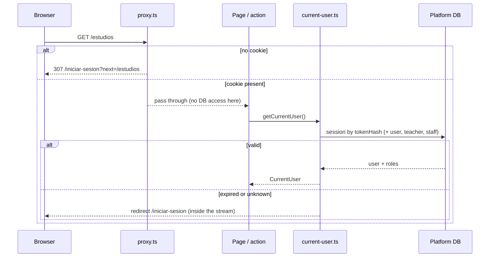

# Authentication & roles

The platform does **not** delegate authentication to Payload or to a third party. Identity, credentials, sessions and roles live in the platform database and in `lib/platform-auth/`.

## Building blocks

| Module | Responsibility |
| --- | --- |
| `lib/platform-auth/password.ts` | scrypt hashing with the cost parameters embedded in the stored string (`scrypt$N$r$p$salt$key`, currently N=32768, r=8, p=1, 64-byte key), constant-time verification, `DUMMY_PASSWORD_HASH` to spend the same time when the email does not exist, `passwordProblem()` (8–200 chars). No `server-only`: the seed and scripts use it. |
| `lib/platform-auth/session.ts` | Opaque sessions: the cookie carries 32 random bytes (base64url); the table stores only its SHA-256. `createSession`, `readSessionUser` (single query that also returns the `teacher` and `staff` rows), `destroyCurrentSession`, `destroyAllSessionsOf`. Sliding renewal at most once a day; expired rows deleted on sight and swept randomly. |
| `lib/platform-auth/current-user.ts` | The **DAL**: `getSessionContext()` (full session, per-request `cache()`), `getSessionUser()` (nullable), `getCurrentUser()` (redirects to the login when there is no valid session). Pages ask for `CurrentUser`, which deliberately carries no roles. |
| `lib/platform-auth/roles.ts` | `getTeacherContext`, `getStaffContext`, `getSessionRoles`, `rolesOf(session)`, and the panel borders `requireTeacher()` / `requireStaff()`. |
| `lib/platform-auth/guards.ts` | Ownership assertions for teacher writes. |
| `lib/platform-auth/temp-password.ts` | 12-character base64url temporary passwords (72 bits) for staff-created accounts. |
| `constants/platform/auth.const.ts` | Cookie name `platform_session`, cookie max age 400 days, session TTL 30 days, renew-after 24 h, `LOGIN_PATH`, `SESSION_ENTRY_PATH`, `RETURN_TO_PARAM = "next"`, login messages, `PROTECTED_PATH_PREFIXES`. No `server-only` because `proxy.ts` imports it. |

### Cookie versus session

The cookie lives 400 days but only transports the token; **`Session.expiresAt` decides**. Logging out or changing the password deletes rows, so revocation is immediate regardless of what the browser keeps. Cookies are `httpOnly`, `sameSite: lax`, `secure` in production, `path: /`.

## Roles are rows

There is no role column. A user is a **teacher** if an active `Teacher` row points at them and **staff** if a `Staff` row does. Roles are orthogonal: the same person can be teacher and staff and still is a student. Both rows are selected in the same query that resolves the session, so asking for a role costs nothing extra.

- `requireTeacher()` is the first `await` of every `/profesor` page and action. No session → login; session without an active teacher row → the student dashboard.
- `requireStaff()` does the same for `/administracion`.
- A deactivated teacher (`Teacher.isActive = false`) keeps classes and history but loses the panel.
- Navigation is **exclusive by role** (`constants/platform/nav-items.const.ts`): staff sees the staff menu, otherwise a teacher sees the teacher menu, otherwise the student menu. Hiding a menu grants nothing; a teacher typing `/estudios` still gets their own studies because those pages are theirs as a user.
- Payload's `admin`/`editor` roles are a different system (other database, other login) and are never mixed with these.

## Request path

`proxy.ts` is an **optimistic** filter that saves a render; it never validates. The DAL is the real check and it also covers server actions, which are reachable by POST without navigation. The "cookie present but session invalid" case therefore reaches the page and is redirected inside the RSC stream (HTTP 200), which is accepted and documented in `IMPROVEMENTS.md` #1c.

Visiting `/` with a cookie goes to `/entrar` (`app/(auth)/entrar/route.ts`), a route handler that reads the real session, redirects to `homeRouteFor(roles)` and, if the cookie is stale, deletes it and returns to `/`. This keeps `/` static and prevents a redirect loop.

## Login and logout

`services/auth/auth.actions.ts`:

- `loginAction(formData)` is a **plain server action** (no `useActionState`) so the entry door works without JavaScript. It trims and bounds the email (254 chars), applies two rate limits (10 attempts per minute per account and 30 per origin, the origin taken from `x-forwarded-for`, which is only trustworthy behind the hosting platform's proxy), looks the user up, verifies the password (or the dummy hash to keep timing constant), creates the session and redirects to the validated `next` path (`safeReturnTo`) or to the role's home. All credential failures return the same message (`credentials`) so the form cannot be used to enumerate accounts; throttling returns `throttled`.
- `logoutAction()` destroys the current session and redirects to the login.

The page `app/(auth)/iniciar-sesion/page.tsx` reads `?next=` and `?error=` and renders `LoginSection` with the hidden return field.

## Accounts

- **No public sign-up.** Staff creates students at `/administracion/alumnos/nuevo` (`createStudentAccount`): the account and its default study "Mis partidas" are created in one transaction; the password is either typed by staff or generated (`generateTempPassword`) and shown once. `resetStudentPassword` generates a new one and destroys every session of that account. Both return state through `useActionState` instead of redirecting, because the password must not travel in a URL.
- **From the terminal:** `npm run user:create -- <email> "<Name>"`, `npm run user:password -- <email>`, `npm run user:list` (`scripts/platform-user.ts`). Passwords are read without echo or from `PLATFORM_USER_PASSWORD`.
- `User.passwordHash = null` means "created without credentials yet": the account cannot log in.
- Teachers are created by staff from an existing account (`createTeacher`), never deleted, only deactivated.

## Rate limiting

`lib/rate-limit.ts` — `allowAction(key, limit, windowMs)`; keys look like `login:<email>`, `<userId>:import`, `<userId>:upload-sign`. One `INSERT … ON CONFLICT` statement decides whether the window is still open (increment) or expired (restart), using the application clock. A database failure lets the action through and logs an error.

## Checklist for a new private feature

1. Page or action starts with `getCurrentUser()` / `requireTeacher()` / `requireStaff()`.
2. Reads filter by the user inside the `where`; writes call a guard or filter the same way.
3. New prefix → `PROTECTED_PATH_PREFIXES` + `proxy.ts` matcher (`npm test` checks it) → `robots.ts` follows automatically.
4. Never read cookies in a page you want prerendered.
